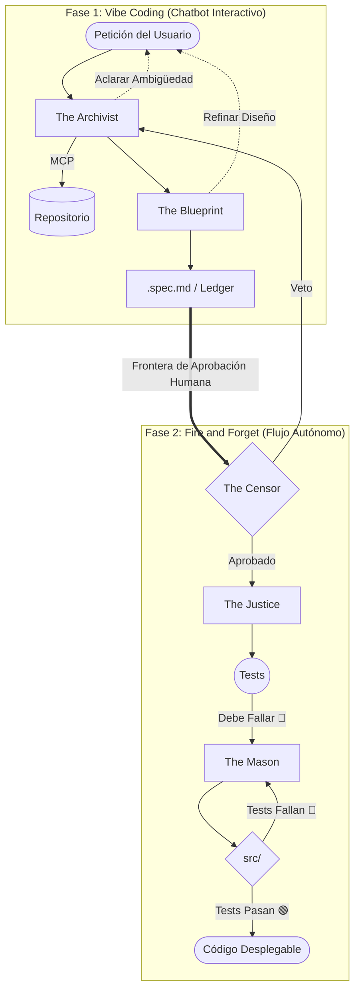

# 📐 Axioma

> El Framework de Desarrollo Spec-Driven para Agentes de IA.
> Rigor sobre velocidad. Ingeniería sobre impulsividad.

[](#-únete-a-la-discusión-rfc)
[](LICENSE)
[](#%EF%B8%8F-stack-tecnológico)
[](README.md)
[](README.es.md)

Axioma es un framework de arquitectura y una metodología diseñada para transformar a los agentes de IA en ingenieros de software rigurosos. Se basa en la premisa de que la ambigüedad es el fallo del sistema y la **Especificación (Spec)** es la única fuente de verdad innegociable.

---

## 💥 ¿Por qué Axioma?

Si iteraste un proyecto usando Vibe Coding, seguro te pasó: le pedís a un agente de IA que agregue una feature nueva y, sin avisar, **modifica o rompe** funcionalidades que ya estaban andando. El agente no tiene memoria de los contratos del sistema — ve código y avanza.

**Ese es el problema que Axioma fue creado para resolver.**

Con Axioma, no hablás con código — **hablás con especificaciones**. En lenguaje natural. El comportamiento de tu sistema se define en archivos `.spec.md`, y los evolucionás a través de un pipeline controlado donde:

*   ✅ Cada cambio está acotado a archivos explícitos (`context_bounds`).
*   ✅ Cada feature tiene criterios de aceptación validados con tests **antes** de la implementación.
*   ✅ Un auditor antagónico (*The Censor*) rechaza cambios vagos o demasiado amplios.
*   ✅ Si la implementación falla, el sistema hace **rollback automático**.

> **Axioma es el primer paso hacia un futuro donde los sistemas complejos se construyen chateando con sus especificaciones — de forma segura, incremental y sin regresiones.**

---

## 🌟 La Visión: Esclavos de Código vs. Ingenieros de Software

El desarrollo asistido por IA hoy sufre de "hiper-actividad":
*   ❌ **Estado Actual (Agentes como "Code Slaves"):** Los agentes escriben código antes de entender realmente el problema, lo que genera deuda técnica, alucinaciones y regresiones.
*   ✅ **Axioma (Agentes como Ingenieros de Software):** Impone un flujo de ingeniería basado en contratos y el ciclo 🟢🔴🟢 (TDD para Agentes). **No se permite escribir una sola línea de código sin una validación previa de la lógica, el alcance y la capacidad de prueba (testability).**

---

## 🔄 El Flujo Axiomático: Vibe Coding y Autonomía

Axioma une lo mejor del mundo conversacional interactivo ("Vibe Coding") con el rigor de la ingeniería de software clásica ("Fire and Forget"). Ejecuta un estricto protocolo dividido por una **Frontera de Aprobación Humana**:



### 🎭 El Elenco: Agentes Especializados

Axioma opera mediante una jerarquía de agentes con roles y responsabilidades innegociables:

**🗣️ Los Agentes de Diseño / Chatbot (Fase 1):**
1.  **The Archivist (El Guardián del Contexto):** Reduce la incertidumbre a cero. Entrevista al usuario, analiza el repositorio mediante MCP y detecta dependencias. No asume; pregunta.
2.  **The Blueprint (El Arquitecto):** Traduce la intención en un archivo `.spec.md` estructurado y define las fixtures (datos sintéticos).

**🤖 Los Constructores Autónomos (Fase 2):**
3.  **The Censor (El Auditor):** Posee poder de veto. Rechaza la Spec si es ambigua, si el alcance es demasiado grande o si rompe reglas invariantes del sistema.
4.  **The Justice (El Juez):** Crea los tests y asegura que fallen (Paso Rojo) antes de permitir cualquier implementación. Es el garante de la verdad.
5.  **The Mason (El Constructor):** El artesano que implementa el código mínimo necesario para satisfacer a The Justice.

---

## 🛠️ Stack Tecnológico

Axioma está diseñado para ser agnóstico pero potenciado por un core de alto rendimiento:

*   **Motor:** Google Gen AI SDK (Gemini 2.0+).
*   **Capacidad:** Soporte nativo de **Model Context Protocol (MCP)** para interactuar de forma segura con el sistema de archivos, Git y el entorno de ejecución.
*   **Seguridad:** Control de estado mediante un **Ledger (Libro de registro)** inyectado en la propia Spec para una trazabilidad total.

---

## 🚀 v1 actual

Este repositorio ya contiene una primera versión funcional de Axioma como CLI local enfocada en **Node + TypeScript + Vitest/Jest**.

Comandos disponibles hoy:

*   `axioma init [repo]`
*   `axioma draft <feature> [--repo <path>]`
*   `axioma audit <spec>`
*   `axioma testgen <spec>`
*   `axioma implement <spec>`
*   `axioma run <spec>`
*   `axioma status <spec>`
*   `axioma spec validate <spec>`

Alcance actual:

*   La spec es la fuente de verdad y el estado vive en el ledger dentro del `.spec.md`.
*   El pipeline puede ejecutarse de punta a punta sobre repos TypeScript soportados.
*   Justice y Mason usan hoy un **bucle mínimo de contrato** para garantizar un ciclo rojo/verde determinista dentro de `context_bounds`.
*   Es una v1 usable, pero todavía no es un paquete publicado ni una solución multi-lenguaje.

---

## 📦 Instalación manual

Hasta que Axioma se publique como paquete, podés instalarlo manualmente desde este repositorio:

```bash
git clone git@github.com:axioma-framework/axioma.git
cd axioma
npm install
npm run build
```

Después podés usar la CLI de una de estas formas:

```bash
node dist/cli/index.js --help
node dist/cli/index.js init /ruta/al/repo-destino
node dist/cli/index.js draft greeting --repo /ruta/al/repo-destino
```

Si querés un comando local durante la experimentación:

```bash
npm link
axioma --help
```

---

## ▶️ Uso manual

Flujo mínimo de punta a punta sobre un repo soportado:

```bash
axioma init /ruta/al/repo-destino
axioma draft greeting --repo /ruta/al/repo-destino
axioma audit /ruta/al/repo-destino/docs/specs/greeting.spec.md
axioma testgen /ruta/al/repo-destino/docs/specs/greeting.spec.md
axioma implement /ruta/al/repo-destino/docs/specs/greeting.spec.md
```

O podés correr el flujo autónomo desde una spec en borrador o aprobada:

```bash
axioma run /ruta/al/repo-destino/docs/specs/greeting.spec.md
```

Forma recomendada del repo destino en esta v1:

*   `package.json` presente
*   código TypeScript bajo `src/` o `lib/`
*   `vitest` o `jest` ya presente en el contrato del repo

---

## 🤖 Prompt para instalar Axioma con otro agente

Si querés que otro agente instale y configure Axioma en un repositorio donde planeás usarlo, podés darle este prompt:

```text
Instala y configura Axioma v1 en este repositorio.

Requisitos:
- Tratá el repositorio actual como el repo destino donde se va a usar Axioma.
- Cloná o usá el framework Axioma desde git@github.com:axioma-framework/axioma.git.
- Compilá Axioma si hace falta.
- Inicializá el repo destino para usar Axioma.
- Verificá si este repo es compatible con los supuestos actuales de Axioma v1:
  - existe package.json
  - el código fuente vive en src/ o lib/
  - vitest o jest está disponible
- No publiques nada ni modifiques código no relacionado.
- Al final, reportá:
  - cómo quedó instalado Axioma
  - qué comando local hay que usar para invocarlo
  - si el repo es compatible ahora mismo
  - el primer comando exacto para redactar una spec en este repo
```

---

## 📂 Estructura del Proyecto

Vista general de la estructura:

```text
/tu-proyecto
├── .axioma/
│   └── prompts/       # Prompts de sistema personalizables para los agentes
├── docs/specs/        # Fuente de la Verdad (.spec.md)
├── docs/fixtures/     # Datos sintéticos vinculados a las specs
└── src/               # Código implementado y validado
```

---

## 📚 Deep Dive (Arquitectura)

Si quieres entender la mecánica rigurosa detrás de Axioma, lee nuestros documentos de arquitectura core:

1.  **[El Estándar Manifest y el Ledger](docs/architecture/01-the-manifest.md):** Por qué el `.spec.md` es la única fuente de verdad.
2.  **[El Elenco de Agentes](docs/architecture/02-the-agents.md):** Análisis profundo de los "Invariants" (reglas inquebrantables) de cada agente especializado.
3.  **[Integración MCP y Seguridad](docs/architecture/03-mcp-integration.md):** Cómo aislamos el acceso para prevenir la destrucción del sistema local.
4.  **[El Bucle Red-Green-Refactor](docs/architecture/04-the-red-green-refactor-loop.md):** El flujo obligatorio de TDD y el `git rollback` automático.

---

## 🤝 Únete a la Discusión (RFC)

Axioma es actualmente un **RFC (Request For Comments)**. No buscamos solo código; buscamos pensamiento crítico y visionarios.

**¿Qué perfiles buscamos?**
*   **Arquitectos de Software** para ayudar a definir el estándar del archivo `.spec.md`.
*   **Prompt Engineers** para calibrar a *The Censor* y formular sus criterios de veto.
*   **Desarrolladores MCP** para construir servidores de acceso seguro y lectura/escritura.

¿Crees en un futuro donde la IA escriba código de calidad industrial? Ayúdanos a definir el estándar.

👉 **[Ve a GitHub Discussions](https://github.com/axioma-framework/axioma/discussions) para participar.**

---

## 📄 Licencia
Este proyecto está bajo la [Licencia Apache 2.0](LICENSE).
