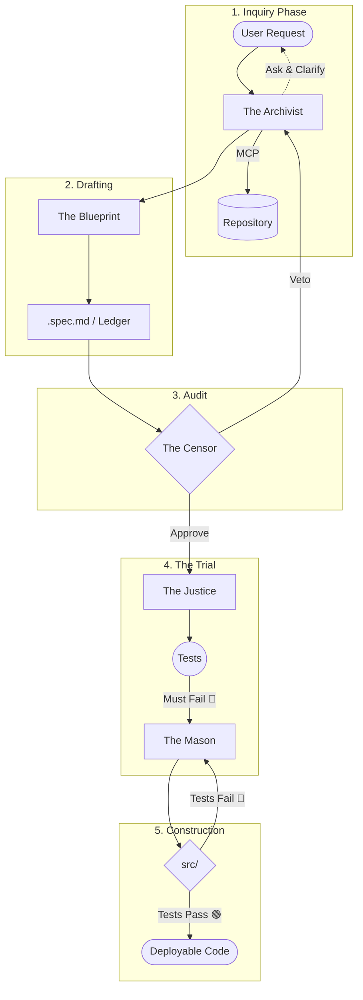

# 📐 Axioma

> The Spec-Driven Development Framework for AI Agents. 
> Rigor over speed. Engineering over impulsivity.

[](#-join-the-discussion)
[](LICENSE)
[](#%EF%B8%8F-technical-stack)
[](README.md)
[](README.es.md)

Axioma is an architectural framework and methodology designed to transform AI agents into rigorous software engineers. It is built on the premise that ambiguity is a system failure and the **Specification (Spec)** is the only non-negotiable source of truth.

---

## 🌟 The Vision: Code Slaves vs. Software Engineers

AI-assisted development today suffers from "hyper-activity":
*   ❌ **Current State (Agents as Code Slaves):** Agents write code before fully understanding the problem, leading to technical debt, hallucinations, and regressions.
*   ✅ **Axioma (Agents as Software Engineers):** Enforces an engineering workflow based on contracts and the 🟢🔴🟢 cycle (TDD for Agents). **No single line of code is allowed to be written without prior validation of logic, scope, and testability.**

---

## 🔄 The Axiomatic Flow

Axioma doesn't just "chat" with code; it executes a strict trust protocol mediated by specialized agents:



### 🎭 The Cast: Specialized Agents

Axioma operates through a hierarchy of agents with non-negotiable roles and honors:

1.  **The Archivist (The Context Guardian):** Reduces uncertainty to zero. Interviews the user, analyzes the repository via MCP, and detects dependencies. It doesn't assume; it asks.
2.  **The Blueprint (The Architect):** Translates intent into a structured `.spec.md` file and defines the fixtures (synthetic data).
3.  **The Censor (The Auditor):** Holds veto power. Rejects the Spec if it is ambiguous, if the scope is too large, or if it breaks system invariants.
4.  **The Justice (The Judge):** Creates the tests and ensures they fail (Red Step) before allowing any implementation. It is the guarantor of truth.
5.  **The Mason (The Builder):** The artisan who implements the minimum code necessary to satisfy The Justice.

---

## 🛠️ Technical Stack

Axioma is designed to be agnostic but powered by a high-performance core:

*   **Engine:** Google Gen AI SDK (Gemini 2.0+).
*   **Capability:** Native **Model Context Protocol (MCP)** support to safely interact with Filesystem, Git, and Runtime.
*   **Safety:** State control via a **Ledger** injected into the Spec itself for total traceability.

---

## 📂 Project Structure

Project structure overview:

```text
/your-project
├── .axioma/
│   └── prompts/       # Customizable Agent System Prompts
├── docs/specs/        # Source of Truth (.spec.md)
├── docs/fixtures/     # Synthetic data linked to specs
└── src/               # Implemented and validated code
```

---

## 📚 Deep Dive (Architecture)

If you want to understand the rigorous mechanics behind Axioma, read our core architectural documents:

1.  **[The Manifest Standard & Ledger](docs/architecture/01-the-manifest.md):** Why `.spec.md` is the only source of truth.
2.  **[The Cast of Agents](docs/architecture/02-the-agents.md):** Deep dive into the invariants of each specialized agent.
3.  **[MCP Integration & Security](docs/architecture/03-mcp-integration.md):** How we isolate access to prevent system destruction.
4.  **[The Red-Green-Refactor Loop](docs/architecture/04-the-red-green-refactor-loop.md):** The mandatory TDD flow and automatic `git rollback`.

---

## 🤝 Join the Discussion (RFC)

Axioma is currently an **RFC (Request For Comments)**. We are not just looking for code; we are looking for critical thinking and visionaries. 

**Who are we looking for?**
*   **Software Architects** to help define the `.spec.md` Manifest Standard.
*   **Prompt Engineers** to calibrate *The Censor* and its veto criteria.
*   **MCP Developers** to build secure write-access servers.

Do you believe in a future where AI writes industrial-grade code? Help us define the standard.

👉 **[Jump to GitHub Discussions](https://github.com/axioma-framework/axioma/discussions) to participate.**

---

## 📄 License
This project is licensed under the [Apache License 2.0](LICENSE).
